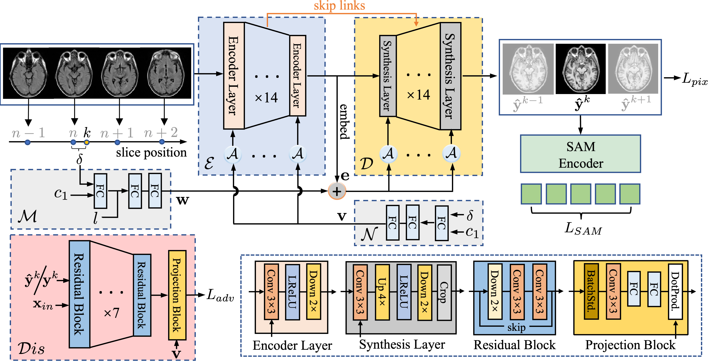

## Uni-COAL: A Unified Framework for Cross-Modality Synthesis and Super-Resolution of MR Images

**Official PyTroch implementation of our journal paper**<br></sub>

<div align="center">
  
</div>

**A Unified Framework for Cross-Modality Synthesis and Super-Resolution of MR Images**<br>
Zhiyun Song, Zengxin Qi, Xin Wang, Xiangyu Zhao, Zhenrong Shen, Sheng Wang, Manman Fei, Zhe Wang, Di Zang, Dongdong Chen, Linlin Yao, Mengjun Liu, Qian Wang, Xuehai Wu, Lichi Zhang<br>

Abstract: *Magnetic resonance imaging (MRI) enhancement techniques, such as cross-modality synthesis (CMS), super-resolution (SR), and their combination (CMSR), are crucial to improve the quality of images produced by simplified scanning protocols. However, existing approaches are typically tailored to specific tasks, limiting their flexibility and generalizability to handle complex clinical scenarios. Moreover, these MRI enhancement methods often treat alias frequencies improperly, resulting in suboptimal detail restoration performance.
In this paper, we propose a Unified CO-modulated ALias-free framework (Uni-COAL) to accomplish the aforementioned tasks with a single network, so that the interaction of these tasks can be established and the resources for training and deploying the models can be greatly reduced. Specifically, the co-modulation design of the image-conditioned and stochastic attribute representations ensures the task consistency between CMS and SR, while simultaneously accommodating arbitrary combinations of modalities and thickness. The generator of Uni-COAL is also designed to be alias-free based on the Shannon-Nyquist signal processing framework, ensuring effective suppression of alias frequencies. Additionally, we leverage the semantic prior of the Segment Anything Model (SAM) to guide Uni-COAL, ensuring a more authentic preservation of anatomical structures during synthesis. Experiments on four datasets demonstrate that Uni-COAL outperforms the alternatives in various combinations of CMS, SR, and CMSR tasks, which highlights its superiority and flexibility to wide-range applications.*

## Release notes

This repository is built upon [CycleGAN and pix2pix in PyTorch](https://github.com/junyanz/pytorch-CycleGAN-and-pix2pix) and our conference version [AFCM](https://github.com/zhiyuns/AFCM). 
It also depends on [Alias-Free GAN](https://github.com/NVlabs/stylegan3) for the alias-free generator and [Segment Anything](https://github.com/facebookresearch/segment-anything) for SAM-guided generation.

## Requirements

* We recommend Linux for performance and compatibility reasons.
* 1 high-end NVIDIA GPUs with at least 48 GB of memory.
* CUDA toolkit 10.2 or later.  Use at least version 11.1 if running on RTX 3090.  (Why is a separate CUDA toolkit installation required?  See comments in [#2](https://github.com/NVlabs/stylegan2-ada-pytorch/issues/2#issuecomment-779457121).)
* 64-bit Python 3.8 and PyTorch 1.9.1. See [https://pytorch.org/](https://pytorch.org/) for PyTorch install instructions. One way to install Pytorch 1.9.1, which has been verify by the author, is:
`pip install torch==1.9.1+cu111 torchvision==0.10.1+cu111 torchaudio==0.9.1 -f https://download.pytorch.org/whl/torch_stable.html`
*  Segment-anything and their pretrained model (sam_vit_b_01ec64.pth) prepared following official instructions in [Segment Anything](https://github.com/facebookresearch/segment-anything).
*  Other dependencies: `pip install -r requirements.txt`

## Preparing datasets

Please make sure that the MR images of a subject have the same shape, which means you should pre-resample the LR image using the nearest intepolation. The first slice of the MR images should be strictly aligned after procedures such as registration.

For training efficiency, we recommend reformatting the dataset as the h5 files. Please refer to `./data/prepare_h5.py` for preparing the h5 dataset. An example of the h5 file is placed at `./data/ixi_demo.h5`.

Then, you need to split the dataset into training/validation/testing by putting them in the corresponding subdirs. You may need to modify the 'loaders.train/test.file_paths' in the config file.

## Getting started
For our main experiment of performing arbitrary target modality synthesis and arbitrary-scale super-resolution on ixi, you can follow our settings with
```.bash
python train.py --config-file ./configs/ixi/multitask/allrand/UniCOAL/6_final.yml --model unicoal
```
For cross-modality synthesis, you can follow our settings with
```.bash
python train.py --config-file ./configs/brats19/T1-T2/UniCOAL/final.yml --model unicoal
```
For super-resolution, you can follow our settings with
```.bash
python train.py --config-file ./configs/adni/UniCOAL/sr_5_sam.yml --model unicoal
```
For simultaneous cross-modality synthesis and super-resolution, you can follow our settings with
```.bash
python train.py --config-file ./configs/adni/UniCOAL/cmsr_sam.yml --model unicoal
```

It is noteworthy that the parameters may not be optimal for your dataset. For example, the readers are encouraged to reduce the learning rate, so that the training procedure is more stable. Taking the cross-modality synthesis task as the example:
```.bash
python train.py --config-file ./configs/brats19/T1-T2/UniCOAL/final.yml --model unicoal optimizer.lr_G 0.00125 optimizer.lr_D 0.001 
```

Once finishing training, you may get the results and the evaluation metrics by running
```.bash
python evaluate.py --config-file evaluate/config/path.yml --model unicoal epoch latest
```
For example, if you want to get the translation results from T1 to T2 on IXI, you can run
```.bash
python evaluate.py --config-file ./configs/ixi/multitask/eval/translation_T1_T2.yml --model unicoal epoch latest
```

## Citation

```
@InProceedings{AFCM,
author="Song, Zhiyun and Wang, Xin and Zhao, Xiangyu and Wang, Sheng and Shen, Zhenrong and Zhuang, Zixu and Liu, Mengjun and Wang, Qian and Zhang, Lichi",
title="Alias-Free Co-modulated Network for Cross-Modality Synthesis and Super-Resolution of MR Images",
booktitle="Medical Image Computing and Computer Assisted Intervention -- MICCAI 2023",
year="2023",
publisher="Springer Nature Switzerland",
address="Cham",
pages="66--76",
}

@article{UniCOAL,
  title={Uni-COAL: A Unified Framework for Cross-Modality Synthesis and Super-Resolution of MR Images},
  author={Song, Zhiyun and others},
  journal={arXiv preprint arXiv:2311.08225},
  year={2023}
}
```

## Development

This is a research reference implementation and is treated as a one-time code drop. As such, we do not accept outside code contributions in the form of pull requests.
